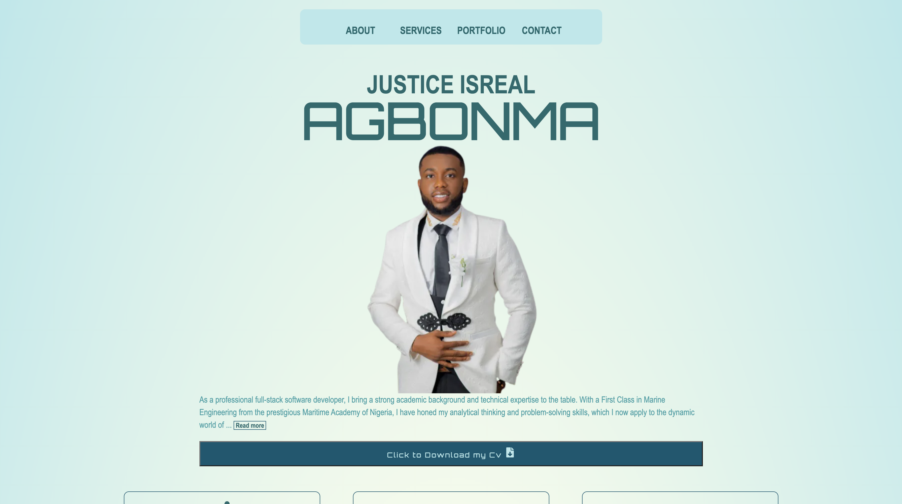

# JUSTICE ISREAL AGBONMA's Portfolio

## Overview

Welcome to my portfolio, a showcase of my work and accomplishments as a software engineer. This portfolio provides an overview of my skills, projects, and experiences in the IT industry.

## About Me

I am a passionate and dedicated Software engineer with a strong background in frontend developement. My journey in software engineering has been defined by a commitment to excellence and a drive to innovate. Through this portfolio, I aim to share my journey and the projects that reflect my expertise and creative vision.

## Key Highlights

- **Project Showcase**: Explore a curated selection of projects that demonstrate my skills and capabilities.
- **Skills**: Discover the skills and technologies I excel in within the software engineering domain.
- **Achievements**: Learn about my notable accomplishments and contributions in [www.justiceagbonma.com].

## Mission

My mission is to , "leverage technology to solve real-world problems," "inspire creativity through design," etc. This portfolio serves as a testament to my dedication to this mission, showcasing how I have made a difference in the world of [Your Field].

## Contact

I'm always open to new opportunities and collaborations. Feel free to reach out to me at justiceyba@gmail.com to discuss potential projects, partnerships, or just to say hello!

## Portfolio Website

You can explore my full portfolio and learn more about me at [www.justiceagbonma.com](https://www.justiceagbonma.com). Thank you for visiting and taking the time to get to know me and my work.
